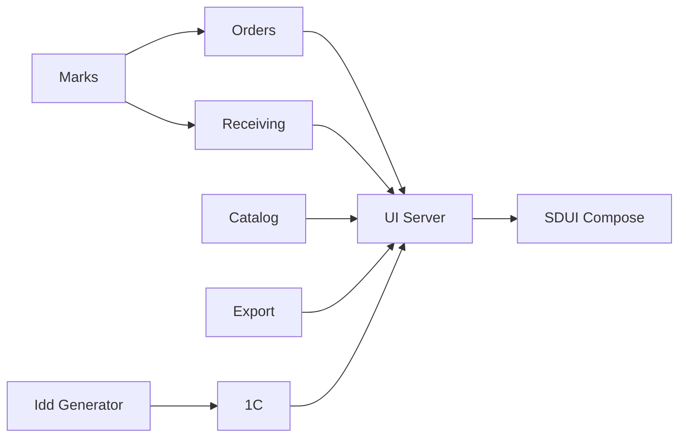

## Микросервис: Интернет заказ
Микросервис "Интернет заказ" (далее Orders) представляет собой набор сервисов, 
предназначенных для удовлетворения потребностей сотрудников магазина при работе 
с интернет заказами по следующим направлениям:

- Принятие C&C заказов
- Сборка C&R / SfS заказов
- Выдача SfS заказов курьеру
- Возврат заказов от курьера
- Расформирование заказов
- Просмотр информации по заказам

Сервис Orders является блоком микросервисной архитектуры, которая призвана дублировать и впоследствии заменить функционал 1С:Предприятия v.7.7.
 
На диаграмме ниже изображена структура микросервисной архитектуры, в состав которой входит микросервис Orders:


Подробно ознакомиться с другими микросервисами можно по ссылкам ниже:

[Catalog](https://gitlab.gloria.aaanet.ru/arm/gloria-jeans-catalog) |
[Receiving](https://gitlab.gloria.aaanet.ru/arm/gloria-jeans-receiving) |
[UI Server](https://gitlab.gloria.aaanet.ru/arm/gloria-jeans-ui-server) | 
[Idd Generator](https://gitlab.gloria.aaanet.ru/arm/gloria-jeans-id-generator) |
[Export](https://gitlab.gloria.aaanet.ru/arm/gloria-jeans-export) |
[Marks](https://gitlab.gloria.aaanet.ru/arm/gloria-jeans-marks) |
[SDUI Compose](https://gitlab.gloria.aaanet.ru/project/sduicompose)

Так же используются внутренние библиотеки [1С DBMapper](https://gitlab.gloria.aaanet.ru/arm/gloria-jeans-onec-db-mapper), 
в которой описаны модели для взаимодействия с 1С и 
[Core](https://gitlab.gloria.aaanet.ru/arm/gloria-jeans-core), 
которая описывает модели взаимодействия между сервисами. 

## Программные требования
- JAVA JDK v. 11
- Spring Boot Framework v. 2.6.6
- Сборщик Apache Maven v. 3.6
## Установка, настройка и запуск

#### 1) Создать подключение к двум базам данных MSSQL (внешняя и внутренняя):

- Внешняя база данных основная и хранит в себе информацию из 1С
- Внутрення (локальная) база данных дополнительная и хранит в себе по большей части временные записи для взаимодействия между сервисами и внешней бд 

Ниже представлен кодовый блок настроек MSSQL:

```
spring:
  datasource-onec-database:
    jdbcUrl: jdbc:sqlserver://{ADDRESS}:{PORT};databaseName={DATABASE_NAME};encrypt=false
    username: {USERNAME}
    password: {PASSWORD}
    driverClassName: com.microsoft.sqlserver.jdbc.SQLServerDriver
  datasource-internal-database:
    jdbcUrl: jdbc:sqlserver://{ADDRESS}:{PORT};databaseName={DATABASE_NAME};encrypt=false
    username: {USERNAME}
    password: {PASSWORD}
    driverClassName: com.microsoft.sqlserver.jdbc.SQLServerDriver
```

#### 2) Указать адрес, порт и количества потоков сервера:

```
server:
  port: {ORDERS_PORT}
  address: {ORDERS_ADDRESS}
  jetty:
    threads:
      max: {MAX_THREADS}
      min: {MIN_THREADS}
```

#### 3) Добавить путь к файлу конфигурации 1С для взаимодействия с внешней базой MSSQL:

```
onec:
  md:
    path: C:/.../1Cv7.MD
```

#### 4) Указать адрес и порт для подключения к сервису генерации "Idd Generator":

```
idd-generator:
   url: http://{ADDRESS}:{PORT}/idd/generator
```

#### 5) **Указать адрес и порт для подключения к сервису проверки марок "Marks":**

```
marks:
  server:
    url: "http://{ADDRESS}:{PORT}"
```

#### 6) Указать адрес сервера авторизации марок и данные для авторизации":

```
marks:
  server:
    authorization:
      url: "https://{ADDRESS}"
      username: {USERNAME}
      password: {PASSWORD}
```

#### 7) Добавить идентификаторы "Idd" принадлежности марок по региону перемещения:

```
marks:
  constants:
    retail_idd
    continent_idd 
    ecommerce_idd
    kazakhstan_idd
```

#### 8) Добавить идентификаторы "ИНН" принадлежности марок по региону перемещения:

```
marks:
  constants:
    retail_tin
    continent_tin
    warehouses_tin
    ecommerce_tin
    kazakhstan_tin
```

#### 9) Добавить идентификаторы "КПП" принадлежности марок по виду перемещения:

```
marks:
  constants:
    retail_rrc
    continent_rrc
    warehouse_rrc
```

#### 10) Добавить идентификатора "ИДЭ" марок:

```
marks:
  constants:
    retail_edm
    continent_edm
    warehouses_edm
```

#### 11) Добавить \ явно указать профиль конфигурации проекта:

В проекте имеется несколько профилей настроек (application).
Необходимо в поле "VM options" (Run - Edit Configurations - VM options) -Dspring.profiles.active 
и значение "dev" или "test". 

#### 12) Запуск:

Необходимо запустить метод главного класса OrdersApplicationTest.java из корня проекта.
